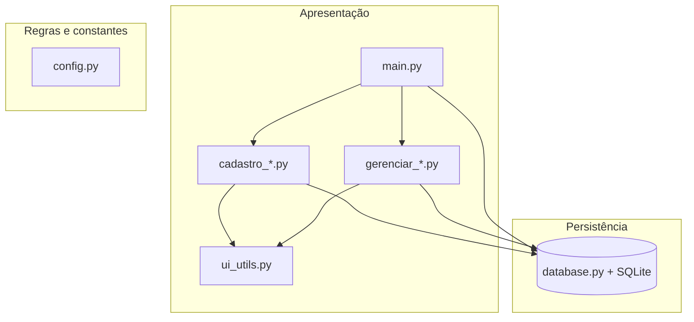

# Alê Sapatilhas — ERP / PDV

Sistema desktop de gestão para loja de calçados e confecções, desenvolvido em **Python** com **Tkinter** e **SQLite**. Projeto voltado a operação comercial real: vendas (PDV), estoque, contatos unificados, contas a pagar/receber e fluxo de caixa.

**Versão atual do código:** `AleSapatilhasVs4.6`

---

## Novidades (Vs 4.6)

| Módulo | Atualização |
|--------|-------------|
| **Produtos** | Fornecedor opcional (texto livre); campo **Tipo** (Calçado / Vestuário); correção de edição e variações; SKU automático; botão **Salvar e Continuar** |
| **Despesas** | Fornecedor opcional; mini calendário nas datas; confirmação antes de salvar/excluir |
| **PDV** | Pagamento ampliado (valor pago, data); finalizar só após preencher pagamento; **Cadastrar Pagamento** → receitas; filtros fixos Cor/Tamanho; miniaturas; pergunta de impressão de recibo |
| **Main** | Utilidades funcionais (calculadora, calendário, anotações); filtros dinâmicos por lista (status, data dia/semana/mês/período); busca com pilha ao apagar |
| **Clientes** | Layout padronizado (700px); **Gerar venda** importa cliente no PDV; confirmações |
| **UI** | `ui_utils.py`: paleta, confirmações, mini calendário, botões de rodapé unificados |

---

## Funcionalidades

| Área | O que o sistema faz |
|------|---------------------|
| **PDV** | Carrinho, cliente, pagamento completo, cadastro de pagamento via receitas, estorno |
| **Estoque** | SKU, grade cor/tamanho, tipo Calçado/Vestuário, variações, foto |
| **CRM** | Cadastro unificado Cliente / Fornecedor |
| **Financeiro** | Receitas e despesas com parcelas e pagamento parcial |
| **Relatórios** | Contas a receber/pagar, fluxo de caixa, dashboard |

---

## Requisitos

- **Python 3.10+** (recomendado 3.11 ou 3.13)
- **Tkinter** (incluso no instalador oficial do Python no Windows)
- **Pillow** (opcional, recomendado para miniaturas de produtos no PDV): `pip install Pillow`
- Demais dependências: ver `requirements.txt` (stdlib na maior parte)

---

## Instalação e execução

```powershell
cd c:\VisualCode\Projeto_ERP_PDV\AleSapatilhasVs4.6

# (Opcional) Pillow para fotos no PDV
pip install Pillow

# (Opcional) Dados de demonstração
python populardb.py

# Iniciar o sistema
python main.py
```

O banco `AleSapatilhasVs4.6db` é criado automaticamente na pasta `AleSapatilhasVs4.6` na primeira execução.

---

## Arquitetura em camadas



### Regra de ouro

| Módulo | Responsabilidade |
|--------|------------------|
| `cadastro_vendas.py` | PDV: itens, estoque, pagamento |
| `gerenciar_receitas.py` | Baixa de parcelas e recebimentos |
| `gerenciar_despesas.py` | Contas a pagar |
| `database.py` | Transações atômicas (venda + estoque + financeiro) |

---

## Estrutura do projeto

```
Projeto_ERP_PDV/
├── README.md
└── AleSapatilhasVs4.6/
    ├── main.py
    ├── config.py
    ├── database.py
    ├── ui_utils.py
    ├── cadastro_clientes.py
    ├── cadastro_produtos.py
    ├── cadastro_vendas.py
    ├── gerenciar_receitas.py
    ├── gerenciar_despesas.py
    ├── populardb.py
    ├── requirements.txt
    └── AleSapatilhasVs4.6db
```

---

## Fluxo operacional

1. Cadastre **contatos** (clientes e fornecedores).
2. Cadastre **produtos** (tipo, grade, SKU).
3. **Gerar vendas** (PDV) → preencha pagamento → finalize ou use **Cadastrar Pagamento**.
4. **Gerenciar receitas** / *Contas a receber* → baixar parcelas.
5. **Adicionar despesas** → contas a pagar.
6. **Fluxo de caixa** e **Dashboard** para visão gerencial.

---

## Modelo de dados (resumo)

- **clientes** — `tipo`: Cliente | Fornecedor
- **produtos** — `tipo`: Calçados | Confecções; fornecedor texto opcional
- **vendas** + **itens_venda**
- **financeiro** — receitas/despesas com `valor_pago`

---

## Padrões de código

- Imports tardios em `main.py` (`abrir_*`)
- Confirmações via `ui_utils.confirmar()`
- Datas com `ui_utils.MiniCalendario`
- Largura padrão de formulários: **700px** (`LARGURA_MODULO_PADRAO`)

---

## Roteiro de estudo

1. `config.py` → `database.py` → `ui_utils.py`
2. `main.py` → `cadastro_vendas.py`
3. `cadastro_produtos.py` / `cadastro_clientes.py`
4. `gerenciar_receitas.py` / `gerenciar_despesas.py`

---

## Testes automatizados

```powershell
cd AleSapatilhasVs4.6
python test_sistema.py
# ou
executar_testes.bat
```

Valida: imports, cliente, produto, variação, despesa, venda e utilitários (banco temporário).

## Documentação no código

- Docstrings em classes e métodos principais nos módulos `.py`
- Índice complementar: `AleSapatilhasVs4.6/INDICE_DOCUMENTACAO.md`

## Evoluções possíveis

- Integração real com impressora de recibos (gancho já no PDV)
- Testes automatizados (`pytest`)
- Backup agendado do SQLite
- Autenticação por usuário

---

## Licença

Projeto educacional / portfólio — **Alê Sapatilhas Vs 4.6**.
